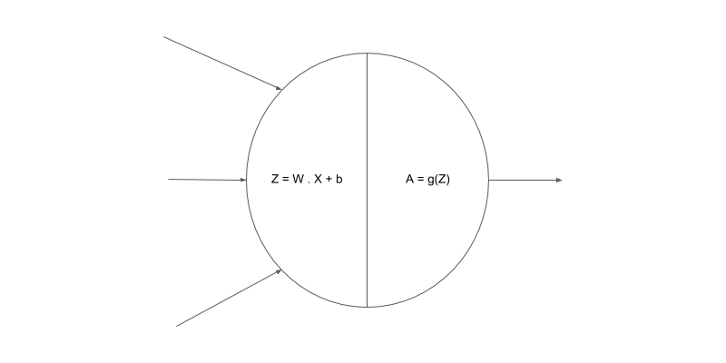

# Basic Image Classification with TensorFlow

Kaggle link: https://www.kaggle.com/code/rasikasrimal/handwrittendigitidentifymodel

## Task 1: Introduction

Welcome to Basic Image Classification with TensorFlow.

This graph describes the problem that we are trying to solve visually. We want to create and train a model that takes an image of a handwritten digit as input and predicts the class of that digit, i.e., it predicts the digit or the class of the input image.

## Task 2: The Dataset

We will use the MNIST dataset, which consists of handwritten digit images.

- **Import MNIST**: We import the dataset and split it into training and test sets.
- **Shapes of Imported Arrays**: We check the shapes of the training and test sets.
- **Plot an Image Example**: We plot an example image from the training set.
- **Display Labels**: We display the labels of the training set.

## Task 3: One Hot Encoding

We convert the labels into a one-hot encoded format.

| Original Label | One-Hot Encoded Label           |
| -------------- | ------------------------------- |
| 5              | [0, 0, 0, 0, 0, 1, 0, 0, 0, 0] |
| 7              | [0, 0, 0, 0, 0, 0, 0, 1, 0, 0] |
| 1              | [0, 1, 0, 0, 0, 0, 0, 0, 0, 0] |

## Task 4: Neural Networks

### Linear Equations

A linear equation represents the relationship between inputs and outputs.

$$ y = w_1 \cdot x_1 + w_2 \cdot x_2 + w_3 \cdot x_3 + b $$

This equation can be vectorized as:

$$
y = W \cdot X + b
$$

### Neural Networks

Neural networks consist of multiple layers of neurons, which allow them to learn complex functions.

## Task 5: Preprocessing the Examples

### Unrolling N-dimensional Arrays to Vectors

We reshape the training and test images into vectors.

### Data Normalization

We normalize the data to have a mean of 0 and a standard deviation of 1.

## Task 6: Creating a Model

### Creating the Model

We create a neural network model with two hidden layers.

### Activation Functions

The activation function introduces non-linearity into the model:

$$
A = f(Z)
$$

### Compiling the Model

We compile the model with a specific optimizer and loss function.

## Task 7: Training the Model

### Training the Model

We train the model on the normalized training data.

### Evaluating the Model

We evaluate the model on the normalized test data and print the accuracy.

## Task 8: Predictions

### Predictions on Test Set

We make predictions on the test set and plot the results.
